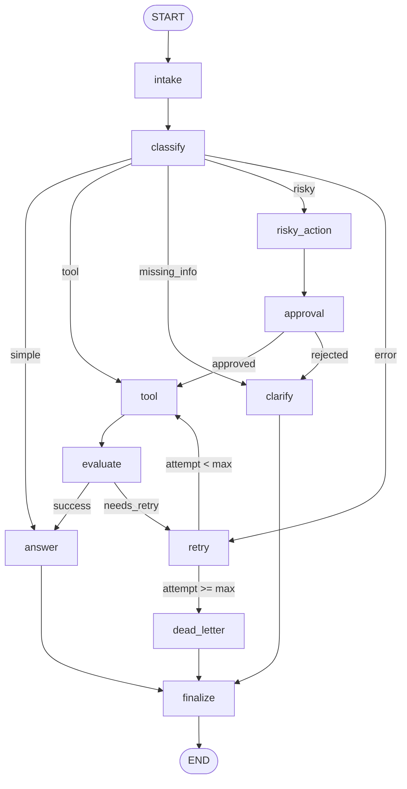

# Day 08 Lab Report

## 1. Team / student

- Name: Nguyen Minh Nhat
- Repo/commit: local working tree
- Date: 2026-08-25

## 2. Architecture

The workflow is a LangGraph `StateGraph` with a single entry path:
`START -> intake -> classify`. Classification then branches to a simple answer,
tool lookup, clarification, or risky-action approval. Tool results pass through
`evaluate`; transient failures go through bounded `retry` back to `tool`, while
exhausted retries go to `dead_letter`. Every branch ends at `finalize -> END`.

## 3. State schema

| Field | Reducer | Why |
|---|---|---|
| `messages` | append | Keep conversational trace entries. |
| `tool_results` | append | Preserve every tool attempt for evaluation and audit. |
| `errors` | append | Preserve retry and failure history. |
| `events` | append | Record every visited node and outcome. |
| `route`, `attempt`, `evaluation_result` | overwrite | Store the current routing state. |
| `approval`, `final_answer`, `pending_question` | overwrite | Store the current decision or user-facing result. |

## 4. Scenario results

| Scenario | Expected route | Actual route | Success | Retries | Interrupts |
|---|---|---|---:|---:|---:|
| - | - | - | NOT RUN | - | - |

### Summary

| Metric | Value |
|---|---:|
| Total scenarios | Not available |
| Success rate | Not available |
| Average nodes visited | Not available |
| Total retries | 0 |
| Total interrupts | 0 |
| Resume success | Not demonstrated |

## 5. Failure analysis

1. Retry or tool failure: a tool result containing `ERROR` becomes
   `needs_retry`. The retry node increments `attempt`; once `attempt >=
   max_attempts`, the graph routes to `dead_letter`, preventing an infinite loop.
2. Risky action without approval: risky requests are prepared first and then
   pass through approval. Rejection routes to clarification and never executes
   the tool branch.
3. Missing information: vague requests do not receive an invented answer;
   `clarify` creates a pending question and then finalizes the audit trail.

The scenario run is blocked because the configured OpenAI provider package
(`langchain-openai`) is not installed in `.venv`; no scenario result is claimed.

## 6. Persistence / recovery evidence

The scenario run uses a per-scenario `thread_id` in the LangGraph config. The
default lab configuration uses the in-memory checkpointer, which supports
thread-scoped state during one process. Crash-resume and durable SQLite
evidence were not part of this Phase 4 run.

## 7. Extension work

The graph includes the approval/HITL node and bounded retry/dead-letter path.
Real interactive interrupts are opt-in through `LANGGRAPH_INTERRUPT=true`.

## 8. Improvement plan

First, add a SQLite checkpointer run with state-history output and a regression
test for restart recovery. Next, replace the mock tool with authenticated,
observable integrations and add latency/error metrics per node. Finally, add a
human approval UI that can resume interrupted runs safely.
